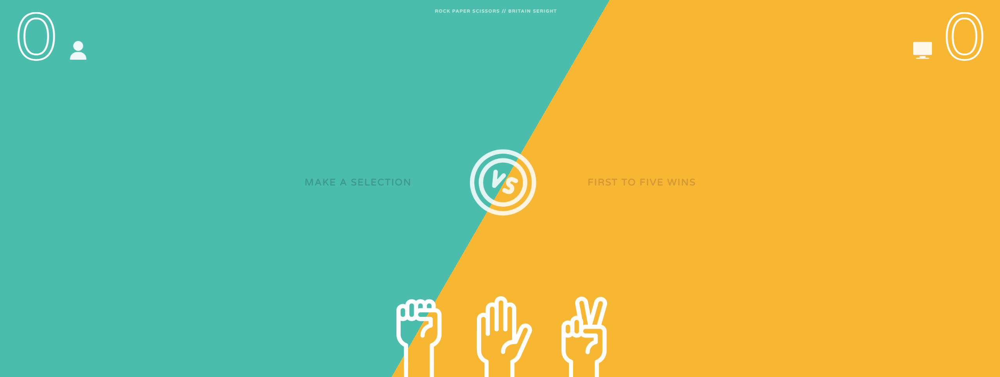

# Rock, Paper, Scissors
> An animated game of Rock, Paper, Scissors with randomized opponent selection. 
> Live demo [_here_](https://bseright.github.io/rock-paper-scissors/).

## Table of Contents
* [General Info](#general-information)
* [Technologies Used](#technologies-used)
* [Features](#features)
* [Screenshots](#screenshots)
* [Room for Improvement](#room-for-improvement)
* [Contact](#contact)

## General Information
- Rock, Paper, Scissors played until the user or CPU reach 5 points.
- CPU selection occurs on page load and the end of every round. 
- Animations for User selection on hover and after selection.
- Stored images transformed to reflect User/CPU selection.
- Point added to the winner of each round with a smooth blink to narrate the winner.
- Restart round after all animations have completed with sequential timeouts. 
- Allow User to play again on game win/loss. 

## Technologies Used
- HTML
- CSS
- Javascript

## Screenshots

## Room for Improvement
- Odd display errors on text-stroke between operating systems... Not sure if this is an experimental error.
- Reduce bloated JS
- Mobile-conscious design.
- Smoother/better animation.

## Contact
Created by Britain Seright ([@bseright](https://github.com/bseright))

Feel free to contact me!  
Email: britainseright@gmail.com
